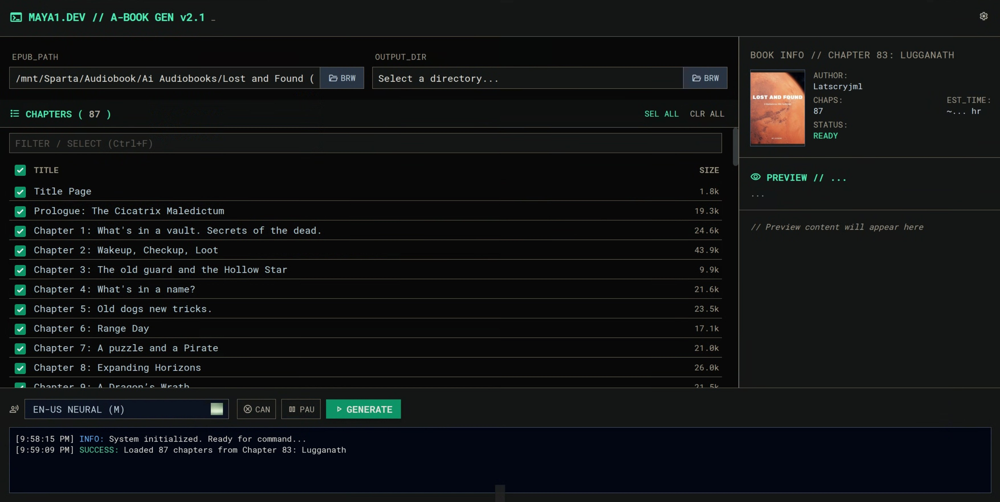
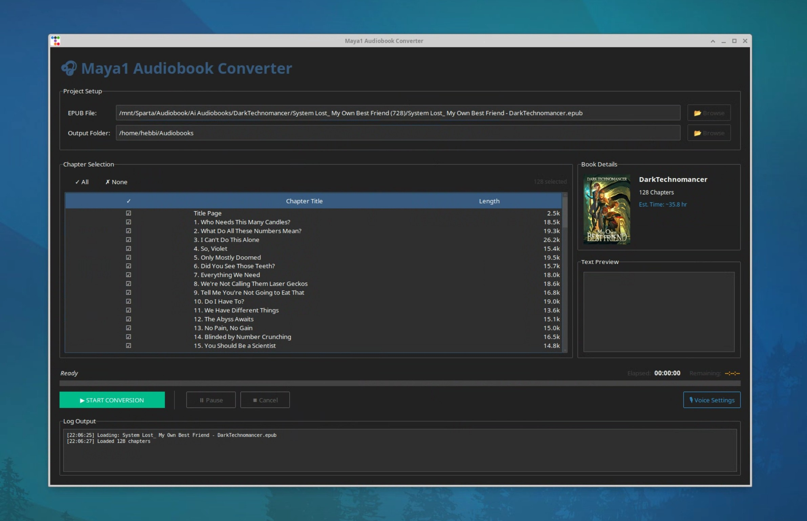

# MBook - AI Audiobook Generator

Convert EPUB files to high-quality M4B audiobooks using state-of-the-art text-to-speech engines: **Maya1** (prompt-based) and **Chatterbox Turbo** (voice cloning).

## Features

### TTS Engines

- **Maya1 TTS** - 3B-parameter model with natural language voice prompts
  - Custom voice descriptions (age, accent, tone, pacing)
  - SNAC neural codec for 24kHz audio output
  - No reference audio required

- **Chatterbox Turbo** - 350M-parameter zero-shot voice cloning
  - Clone voices from 5-20 second reference audio samples
  - 22.05kHz output with natural prosody
  - Custom narrator voices (place your own samples in `voice_samples/`)
  - Built-in voice presets + custom voice support

### Core Features

- **EPUB Support** - Parses EPUB files and extracts chapters automatically
- **M4B Export** - Creates audiobook files with chapter markers and metadata
- **Dual UI Options** - Choose between browser-accessible WebUI or Electron desktop app
- **Voice Presets** - 8 quick-select presets (3 Maya1 + 5 Chatterbox)
- **Real-time Progress** - SSE-based live updates with pause/cancel/resume controls
- **Progress Tracking** - Resume interrupted conversions from saved chunks
- **Remote-Friendly** - Manual path entry and drag-and-drop support for remote/headless setups
- **Audiobookshelf Ready** - Outputs organized for Audiobookshelf library management

## Requirements

- Python 3.10+ (3.11 recommended for Chatterbox Turbo)
- CUDA-capable GPU with 8GB+ VRAM (16GB+ recommended for Maya1, 4GB+ for Chatterbox)
- ffmpeg installed on system
- Node.js 14+ and npm (for Electron desktop UI only)

**Note**: For RTX 50 series (Blackwell) GPUs, Chatterbox Turbo requires PyTorch 2.9.1+ with CUDA 12.8+. See [CHATTERBOX_SETUP.md](CHATTERBOX_SETUP.md) for details.

## Installation

```bash
# Clone the repository
git clone https://github.com/hebbihebb/MBook.git
cd MBook

# Create virtual environment
python -m venv venv
source venv/bin/activate  # Linux/Mac
# or: .\venv\Scripts\activate  # Windows

# Install dependencies
pip install -r requirements.txt

# Download spacy model
python -m spacy download en_core_web_sm

# (Optional) Install Chatterbox Turbo for voice cloning
pip install chatterbox-tts

# (Optional) Generate default voice samples for Chatterbox
python generate_voice_samples.py

# (Optional) Install Electron desktop UI dependencies
cd webview_ui
npm install
cd ..
```

**Model downloads**
- Maya1 TTS (~6.6GB) is expected at `models/maya1`. If it is missing, the app will fail to load the model.
- Chatterbox Turbo (~350MB) downloads on first use if `chatterbox-tts` is installed.
- SNAC decoder and Silero VAD download on first use into their default caches.

To pre-download everything (recommended for offline use):
```bash
python setup_models.py
```

## Usage

### Desktop shortcuts (optional)

To install desktop launchers that point to your current repo location:
```bash
./install_desktop_shortcuts.sh
```

This generates `.desktop` files under `~/.local/share/applications` using the templates in the repo.

### Web UI (Recommended)



**Electron Desktop App:**
```bash
cd webview_ui
npm start
```

**Or Browser Access:**
```bash
python webview_ui/webview_server.py
# Then open http://localhost:5000 in your browser
```

The web UI features a terminal-style interface with:
- Modern dark terminal aesthetic
- Real-time progress updates via SSE (Server-Sent Events)
- **Unified Configuration**: Centralized settings for Maya1 and Chatterbox engines
- **Remote Access Support**: Manual path entry and directory selection for headless servers
- **Convenient Uploads**: Drag-and-drop EPUB support with automatic parsing
- **8 voice presets**: 3 Maya1 (prompt-based) + 5 Chatterbox (voice cloning)
- Pause, cancel, and resume controls
- Chapter selection with **instant text preview**
- Book cover display with metadata
- Custom voice prompt editor
- Live conversion statistics

### tkinter GUI (Alternative)



```bash
python main.py
```

The tkinter GUI provides:
- EPUB file and output folder selection
- Chapter list with select all/none
- Book cover preview
- Voice prompt customization
- Real-time progress with elapsed/remaining time
- Pause, resume, and cancel controls

### Command Line

```bash
# Convert an EPUB to M4B
python convert_epub_to_audiobook.py "Book Title.epub"

# Test mode (first N chunks only)
python convert_epub_to_audiobook.py "Book Title.epub" --test 10

# Custom voice
python convert_epub_to_audiobook.py "Book Title.epub" \
  --voice "Female narrator in her 20s with an American accent. Warm, clear, expressive tone."

# Custom output directory
python convert_epub_to_audiobook.py "Book Title.epub" -o /path/to/output
```

## Voice Options

### Built-in Voice Presets

The WebUI includes 8 quick-select voice presets:

**Maya1 (Prompt-based TTS):**
- **EN-US NEURAL (M)** - Male narrator in 40s, American accent, warm baritone, calm pacing
- **EN-US NEURAL (F)** - Female narrator in 30s, American accent, professional and engaging
- **EN-GB STANDARD** - Male narrator in 40s, British accent, classic BBC style

**Chatterbox Turbo (Voice Cloning):**
- **EN-US CHATTERBOX (M)** - American male narrator (cloned from reference audio)
- **EN-US CHATTERBOX (F)** - American female narrator (cloned from reference audio)
- **EN-GB CHATTERBOX** - British male narrator (cloned from reference audio)
- **CUSTOM VOICES** - Add your own 5-20s WAV samples to `voice_samples/` directory

### Maya1 Voice Descriptions

Maya1 uses natural language voice descriptions for on-the-fly voice synthesis:

### Custom Voice Examples

```
# Professional audiobook narrator
Male narrator voice in his 40s with an American accent. Warm baritone, calm pacing, clear diction.

# Young female narrator
Female voice in her 20s with a British accent. Light, energetic, conversational delivery.

# Character voices
Dark villain character. Male voice in their 40s with a British accent. Low pitch, gravelly timbre, slow pacing.
```

### Supported Voice Attributes (Maya1)

| Attribute | Options |
|-----------|---------|
| Age | 20s, 30s, 40s, 50s+ |
| Gender | Male, Female |
| Accent | American, British, Australian, etc. |
| Timbre | Warm, gravelly, robotic, ethereal |
| Pacing | very_slow, slow, conversational, brisk, fast |
| Emotion | neutral, energetic, excited, sad, sarcastic |

### Chatterbox Voice Cloning

Clone any voice using a 5-20 second reference audio sample:

1. **Prepare reference audio** (8-15s recommended):
   - WAV format, 22.05kHz sample rate, mono
   - Clean speech with no music/background noise
   - Natural prosody and clear diction

2. **Add to voice samples**:
   ```bash
   # Convert your audio to correct format
   ffmpeg -i your_voice.mp3 -ar 22050 -ac 1 voice_samples/my_narrator.wav
   ```

3. **Use in WebUI**: Select from Chatterbox presets or use test scripts:
   ```bash
   # Test with quick script
   python quick_test_chatterbox.py

   # Or full GUI tester
   python test_chatterbox_gui.py
   ```

See [voice_samples/README.md](voice_samples/README.md) for detailed voice sample requirements and troubleshooting.

### Debug logging (WebUI)

Set `MBOOK_DEBUG_CHUNKS=1` to log per-chunk details and save chunk text files in the output `temp_chunks` directory. Leave this off for normal use.

## Security

MBook includes several security enhancements to protect against common vulnerabilities:

- **CSRF Protection**: The Web UI uses Flask-WTF to prevent cross-site request forgery.
- **Secure Binding**: The web server binds to `127.0.0.1` by default to prevent unauthorized network access.
- **Robust Path Handling**: Strict validation for file uploads and path access to prevent traversal vulnerabilities.
- **ZIP Bomb Protection**: Secure EPUB extraction limits file sizes to prevent resource exhaustion.
- **Input Sanitization**: Protection against prompt injection in voice descriptions.

## Project Structure

```
MBook/
├── main.py                       # tkinter GUI application
├── convert_epub_to_audiobook.py  # Main converter with Maya1 TTS engine
├── chatterbox_engine.py          # Chatterbox Turbo TTS engine
├── assembler.py                  # Audio stitching and M4B export
├── epub_parser.py                # EPUB file parser
├── fast_maya_engine.py           # Batch processing engine (experimental)
├── pipeline.py                   # Legacy Maya1 pipeline wrapper
├── requirements.txt              # Python dependencies
├── CHATTERBOX_SETUP.md           # Chatterbox installation guide
├── generate_voice_samples.py     # Generate default voice samples
├── quick_test_chatterbox.py      # Quick Chatterbox test script
├── test_chatterbox_gui.py        # Interactive Chatterbox testing GUI
├── test_chatterbox_e2e.py        # End-to-end pipeline test
├── voice_samples/                # Voice reference audio for Chatterbox
│   ├── README.md                 # Voice sample requirements guide
│   └── *.wav                     # Reference audio files (generated locally)
├── webview_ui/                   # Web UI (Electron + Browser)
│   ├── main.js                   # Electron entry point
│   ├── preload.js                # Electron IPC bridge
│   ├── webview_server.py         # Flask backend server
│   ├── conversion_worker.py      # Background conversion thread
│   ├── conversion_state.py       # State management
│   ├── package.json              # Node.js dependencies
│   ├── templates/
│   │   └── index.html            # Web UI template
│   └── static/
│       └── main.js               # Frontend JavaScript (Electron + Browser compatible)
├── docs/                         # Documentation and guides
│   ├── images/                   # Screenshots
│   └── vllm_blackwell_setup.md   # vLLM setup for RTX 50 series
└── models/                       # Downloaded model files
    ├── maya1/                    # Maya1 model (~6.6GB, auto-downloaded)
    └── chatterbox/               # Chatterbox model (~350MB, auto-downloaded)
```

## Performance

### Maya1 TTS

| Metric | Value |
|--------|-------|
| Generation Speed | ~2x realtime (30s audio in 60s) |
| Optimal Chunk Size | 40-60 words |
| GPU Memory | ~6GB VRAM (peaks at ~10GB) |
| Audio Quality | 24kHz SNAC codec |

### Chatterbox Turbo TTS

| Metric | Value |
|--------|-------|
| Generation Speed | ~0.3x realtime (faster than real-time on GPU) |
| Optimal Chunk Size | 40-60 words |
| GPU Memory | ~4GB VRAM |
| Audio Quality | 22.05kHz, natural prosody |
| Voice Cloning | Zero-shot from 5-20s reference audio |

## Speed Optimization (Experimental)

For faster generation, the codebase includes experimental support for:

- **lmdeploy** - Up to 10x faster with batching (see `fast_maya_engine.py`)
- **vLLM** - OpenAI-compatible API server with continuous batching

> **Note**: These require building from source for RTX 50 series (Blackwell) GPUs.
> See `docs/vllm_blackwell_setup.md` for setup instructions.

## Logging

All conversions create a log file in the output directory:
```
audiobook_output/conversion_BookName_20251210_120000.log
```

## License

MIT License - See LICENSE file for details.

## Credits

### TTS Models
- **Maya1**: [maya-research/maya1](https://huggingface.co/maya-research/maya1) - Apache 2.0
- **Chatterbox Turbo**: [ResembleAI/chatterbox-turbo](https://huggingface.co/ResembleAI/chatterbox-turbo) - Apache 2.0
- **SNAC Codec**: [hubertsiuzdak/snac_24khz](https://huggingface.co/hubertsiuzdak/snac_24khz)

### Frameworks & Tools
- **PyTorch**: Deep learning framework
- **ttkbootstrap**: Dark theme GUI framework
- **Flask**: Web server backend for web UI
- **Electron**: Cross-platform desktop application framework
