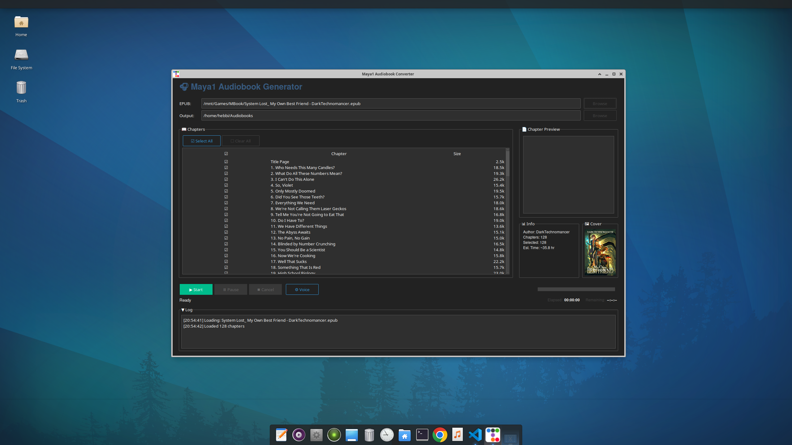

# MBook - Maya1 Audiobook Generator

Convert EPUB files to high-quality M4B audiobooks using Maya1's native text-to-speech with SNAC neural codec.



## Features

- **Native Maya1 TTS** - Uses the 3B-parameter Maya1 model for natural speech synthesis
- **SNAC Neural Codec** - 24kHz audio output with excellent quality
- **Voice Customization** - Natural language voice descriptions (age, accent, tone, pacing)
- **EPUB Support** - Parses EPUB files and extracts chapters automatically
- **M4B Export** - Creates audiobook files with chapter markers and metadata
- **GUI Application** - Modern dark-themed interface with chapter selection
- **Progress Tracking** - Resume interrupted conversions from saved chunks
- **Audiobookshelf Ready** - Outputs organized for Audiobookshelf library management

## Requirements

- Python 3.10+
- CUDA-capable GPU with 8GB+ VRAM (16GB+ recommended)
- ffmpeg installed on system

## Installation

```bash
# Clone the repository
git clone https://github.com/hebbihebb/MBook.git
cd MBook

# Create virtual environment
python -m venv venv
source venv/bin/activate  # Linux/Mac
# or: .\venv\Scripts\activate  # Windows

# Install dependencies
pip install -r requirements.txt

# Download spacy model
python -m spacy download en_core_web_sm
```

The Maya1 model (~6.6GB) will be downloaded automatically on first run.

## Usage

### GUI Application (Recommended)

```bash
python main.py
```

The GUI provides:
- EPUB file and output folder selection
- Chapter list with select all/none
- Book cover preview
- Voice prompt customization
- Real-time progress with elapsed/remaining time
- Pause, resume, and cancel controls

### Command Line

```bash
# Convert an EPUB to M4B
python convert_epub_to_audiobook.py "Book Title.epub"

# Test mode (first N chunks only)
python convert_epub_to_audiobook.py "Book Title.epub" --test 10

# Custom voice
python convert_epub_to_audiobook.py "Book Title.epub" \
  --voice "Female narrator in her 20s with an American accent. Warm, clear, expressive tone."

# Custom output directory
python convert_epub_to_audiobook.py "Book Title.epub" -o /path/to/output
```

## Voice Descriptions

Maya1 uses natural language voice descriptions. Examples:

```
# Professional audiobook narrator
Male narrator voice in his 40s with an American accent. Warm baritone, calm pacing, clear diction.

# Young female narrator
Female voice in her 20s with a British accent. Light, energetic, conversational delivery.

# Character voices
Dark villain character. Male voice in their 40s with a British accent. Low pitch, gravelly timbre, slow pacing.
```

### Supported Voice Attributes

| Attribute | Options |
|-----------|---------|
| Age | 20s, 30s, 40s, 50s+ |
| Gender | Male, Female |
| Accent | American, British, Australian, etc. |
| Timbre | Warm, gravelly, robotic, ethereal |
| Pacing | very_slow, slow, conversational, brisk, fast |
| Emotion | neutral, energetic, excited, sad, sarcastic |

## Project Structure

```
MBook/
├── main.py                       # GUI application
├── convert_epub_to_audiobook.py  # Main converter with Maya1 TTS engine
├── assembler.py                  # Audio stitching and M4B export
├── fast_maya_engine.py           # Batch processing engine (experimental)
├── pipeline.py                   # Legacy Maya1 pipeline wrapper
├── requirements.txt              # Python dependencies
├── docs/                         # Documentation and guides
│   ├── images/                   # Screenshots
│   └── vllm_blackwell_setup.md   # vLLM setup for RTX 50 series
└── models/                       # Downloaded Maya1 model files
```

## Performance

| Metric | Value |
|--------|-------|
| Generation Speed | ~2x realtime (30s audio in 60s) |
| Optimal Chunk Size | 40-60 words |
| GPU Memory | ~6GB VRAM (peaks at ~10GB) |

## Speed Optimization (Experimental)

For faster generation, the codebase includes experimental support for:

- **lmdeploy** - Up to 10x faster with batching (see `fast_maya_engine.py`)
- **vLLM** - OpenAI-compatible API server with continuous batching

> **Note**: These require building from source for RTX 50 series (Blackwell) GPUs.
> See `docs/vllm_blackwell_setup.md` for setup instructions.

## Logging

All conversions create a log file in the output directory:
```
audiobook_output/conversion_BookName_20251210_120000.log
```

## License

MIT License - See LICENSE file for details.

## Credits

- **Maya1 Model**: [maya-research/maya1](https://huggingface.co/maya-research/maya1) - Apache 2.0
- **SNAC Codec**: [hubertsiuzdak/snac_24khz](https://huggingface.co/hubertsiuzdak/snac_24khz)
- **ttkbootstrap**: Dark theme GUI framework
